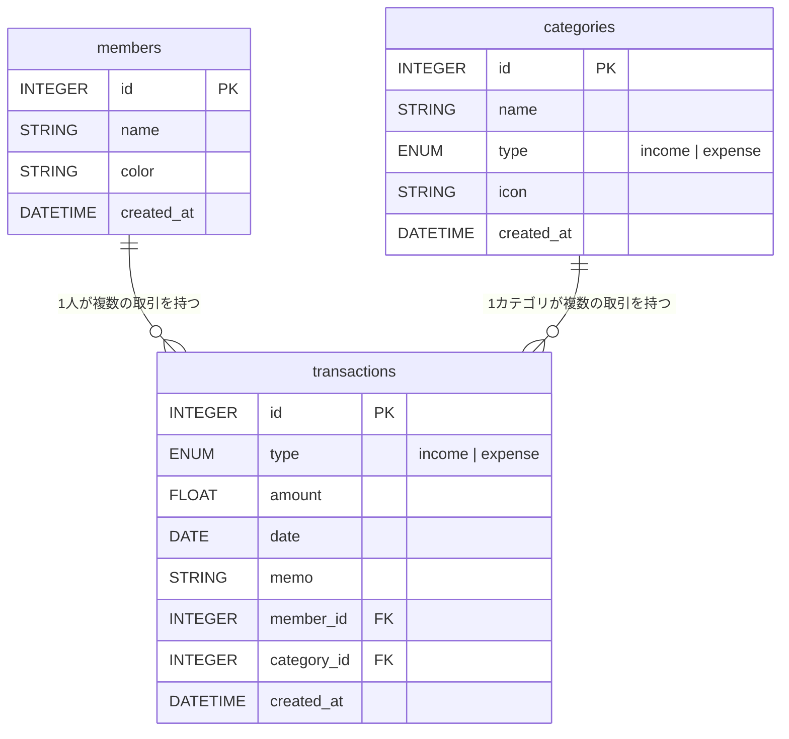

# 家計簿アプリ

家族でWi-Fiを通じて共有できる家計簿アプリです。

## 機能

- **収支管理**: 日付・カテゴリ・メンバー別に収入・支出を記録
- **月次レポート**: 支出の円グラフ・月次推移のバーチャート
- **家族メンバー管理**: メンバーごとに色付きで管理
- **カテゴリ管理**: 支出・収入カテゴリをカスタマイズ
- **スマホ対応**: レスポンシブデザイン

## 技術スタック

- **フロントエンド**: React + TypeScript + Vite
- **バックエンド**: Python + FastAPI
- **データベース**: SQLite
- **インフラ**: Docker Compose

## 起動方法

### 前提条件

- Docker Desktop がインストールされていること

### 手順

```bash
# このディレクトリで実行
docker-compose up --build
```

起動後:
- フロントエンド: http://localhost:3000
- バックエンド API: http://localhost:8000
- API ドキュメント: http://localhost:8000/docs

### 家族のスマホから接続する

同じWi-Fiに接続した状態で、PCのIPアドレスを確認:

```bash
# Windows
ipconfig
# Mac/Linux
ifconfig
```

スマホのブラウザで `http://<PCのIPアドレス>:3000` にアクセスしてください。

## 初期データ

起動時に以下のカテゴリが自動で追加されます:

**支出**: 食費、日用品、交通費、光熱費、医療費、衣服、娯楽、教育、その他支出

**収入**: 給与、副収入、その他収入

## ログ

バックエンドは2種類のログファイルを日付ごとに出力します。

| ファイル名 | 出力内容 |
|---|---|
| `db_YYYY-MM-DD.log` | DB への書き込み操作（登録・更新・削除）とそのペイロード |
| `error_YYYY-MM-DD.log` | DB 操作の例外・未処理の HTTP エラー |

日付が変わると自動で新しいファイルに切り替わります。

### ログの保存先

Docker 環境ではコンテナ内の `/app/logs/` に出力されます。  
`LOG_DIR` 環境変数で変更できます。

```bash
# ログをリアルタイムで確認する
docker exec kakeibo-backend tail -f /app/logs/db_$(date +%Y-%m-%d).log
docker exec kakeibo-backend tail -f /app/logs/error_$(date +%Y-%m-%d).log
```

### ログのフォーマット

```
2026-05-04 12:34:56,789 [INFO] transaction created: {'type': 'expense', 'amount': 1500.0, ...}
2026-05-04 12:35:10,123 [ERROR] Failed to create transaction: ... | data={...}
```

## DB 構成



## 開発

```bash
# バックエンドのみ起動
cd backend
pip install -r requirements.txt
uvicorn main:app --reload

# フロントエンドのみ起動
cd frontend
npm install
npm run dev
```
